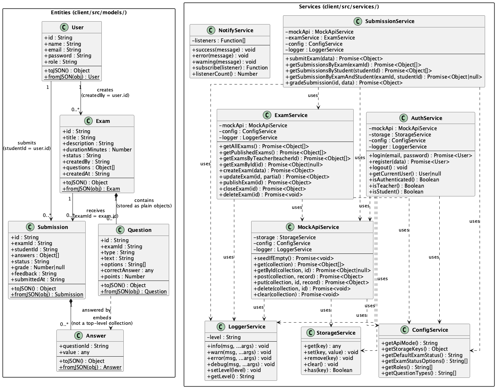
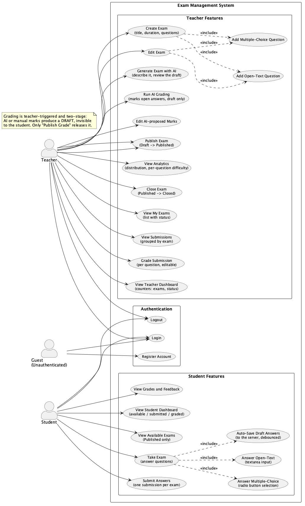

# Full Stack Exam Management System — Milestone 1

A modular React + Express client/server foundation for managing online exams and student submissions.

## Project Goal

Build a full stack web application for managing online exams and student submissions.

## Milestone 1 Scope

Milestone 1 establishes the architecture foundation: Vite+React client, Express skeleton, mock persistence via localStorage, OOP service layer, role-based Teacher/Student flows, documentation, and diagrams. No real backend, DB, or JWT yet.

---

## Repository

- **GitHub:** https://github.com/dormor589/EMS_M1
- **Working branch:** `dev`
- **Main branch:** `main` (stable, updated only at milestone review)

---

## Quick Start

### Client (React + Vite)

```bash
cd client
npm install
npm run dev
# → http://localhost:5173
```

Build for production:

```bash
cd client
npm run build
# output in client/dist/
```

### Server (Express skeleton)

```bash
cd server
npm install
node src/app.js
# → http://localhost:4000
```

Health check:

```bash
curl http://localhost:4000/health
# { "status": "ok", "milestone": "M1", "time": "..." }
```

> Port is configurable via `PORT` environment variable (default 4000).

---

## Project Structure

```
EMS_M1/
├── client/             # Vite + React 19 frontend
│   └── src/
│       ├── app/        # App.jsx, routes.jsx
│       ├── components/ # layout/, shared/
│       ├── pages/      # auth/, teacher/, student/
│       ├── services/   # OOP service layer
│       ├── data/       # seedData.js
│       └── models/     # User, Exam, Question, Submission
├── server/             # Express skeleton (Milestone 2+ for real routes)
│   └── src/
│       ├── app.js
│       ├── routes/
│       ├── controllers/
│       ├── services/
│       ├── models/
│       └── middleware/
├── docs/
│   ├── explanation.txt # Plain-text feature documentation
│   └── diagrams/       # PlantUML + text diagrams
└── README.md
```

---

## Documentation

- **Feature explanation:** [`docs/explanation.txt`](docs/explanation.txt) — features, users, pages, services, and current limitations (plain text).
- **Diagrams:** [`docs/diagrams/`](docs/diagrams/) — component hierarchy, class diagram, use-case diagram, entities reference (sources + pre-rendered PNGs).

---

## Diagrams

Source files live in `docs/diagrams/` (`.puml` for PlantUML, `.txt` for plain text).
Pre-rendered PNGs for the PlantUML diagrams:

- 
- 

---

## Technology Stack

| Layer    | Technology                    |
|----------|-------------------------------|
| Client   | React 19, Vite 6, JavaScript  |
| Router   | react-router-dom v7           |
| Server   | Node 22, Express 5, ESM       |
| Storage  | localStorage (mock, M1 only)  |
| Tests    | Vitest                        |
| Future   | PostgreSQL, JWT, bcrypt (Milestone 2+) |

---

## Roles

| Role    | Capabilities                                           |
|---------|--------------------------------------------------------|
| Teacher | Create/edit/publish exams, view submissions, grade     |
| Student | View published exams, take exam, submit, view grades   |

---

## Known Limitations (Milestone 1)

- No real authentication (mock only).
- No database — data persisted in `localStorage`.
- No JWT / bcrypt.
- No backend routes beyond `/health`.
- No real-time features.
- Deployment not configured.
